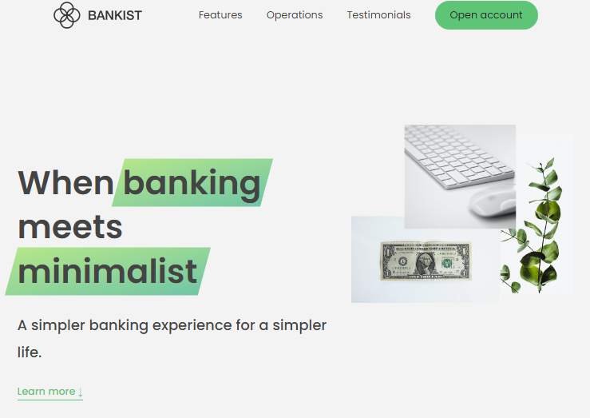

## Bankist Website

### This is a project from an Udemy course by Jonas Schmedtman called Bankist Website.

### The purpose of this is to practise and work with DOM manipulation and events.

##

#### To check its funtionality, you need to preview the HTML file.

###### You can check the demo on the following link: bankist-dom.netlify.app
